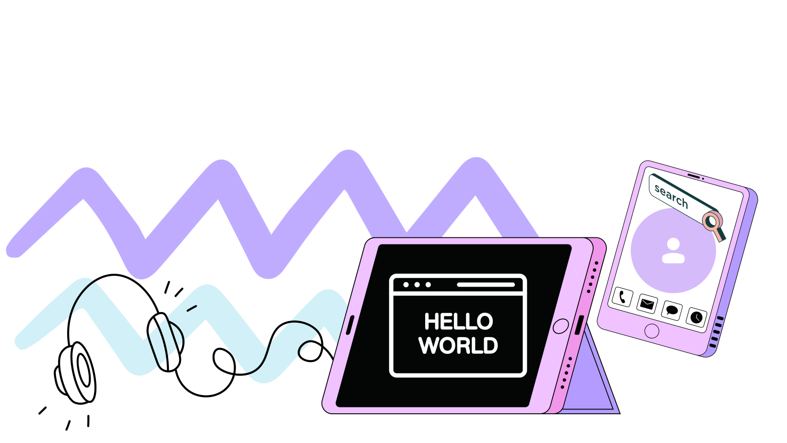

<h1 align="left">Hi 👋🏽, I'm Maureen</h1>

🌍[Portfolio](https://portafolio-maureen.vercel.app/)

<h3 align="left">I have a passion for programming and technology! 🚀</h3>

    <h3>👨🏽‍💻 About me:</h3>
        
• 📚 I’m currently learning: <b>Front-end development JavaScript with React, trying to get my first experience as a developer.</b>

        
• ℹ️ Hobbies: <b>Movies 🍿| Series 🎞️ |Games 🎮 | Music 🎧 | Swimming Pool 🥽 </b>

        
• 💬 Ask me about: <b> Coffee and movies</b>

        
• 👓Linkedin: <b>https://www.linkedin.com/in/maureen-cris/</b>

 

    
    

    
---

  <h3>🧰 Languages and tools I'm learning until now:</h3> 
    
    
    
    
    
     
      
    
    

___

  <h3>📱 Social Medias:</h3> 
    

------

Credit: [MCristina94](https://github.com/MCristina94)

